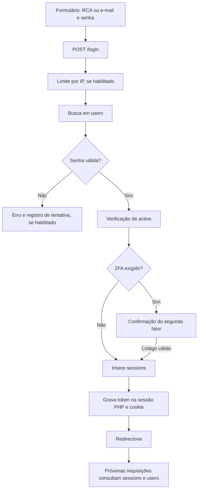

# Autenticação da academia PHP: funcionamento e referência para migração

Data da análise: **02/09/2026**.

## 1. Objetivo, fontes e limites

Este documento reconstrói a autenticação da aplicação antiga para orientar a reformulação. Descreve o que o código faz, inclusive inconsistências; não especifica que a aplicação nova deva repetir esses comportamentos.

Fontes utilizadas:

- Código PHP em `C:\Users\Okajima\Documents\academia-okajima-old`.
- [Dump antigo com dados](C:/Users/Okajima/Documents/academia-okajima-old/Academia_Okajima.sql:1), cujo cabeçalho informa **15/12/2025**. Usado apenas para identificar configurações históricas, sem copiar senhas, tokens ou dados pessoais para esta documentação.
- [Schema importado no projeto novo](C:/Users/Okajima/Documents/ChatGPT/academia-okajima/database/legacy-schema.sql:1), originado da exportação de **02/09/2026**, com 66 tabelas e sem registros.
- [Configuração do banco local](C:/Users/Okajima/Documents/ChatGPT/academia-okajima/docs/banco-local.md:1): MySQL 5.7.44, banco `academia_local`.

**Limites:** análise estática. Não executamos o PHP, não fizemos login em produção, não testamos SMTP/provedores externos e não confirmamos cron, configuração efetiva do servidor ou uso dos aplicativos clientes. Existência de um endpoint na pasta não comprova que ele esteja publicado ou utilizado. A configuração de dezembro de 2025 não comprova o estado atual da produção. O schema de setembro de 2026 não contém valores da tabela `config`.

Os links apontam para arquivos locais e linhas da cópia analisada. Não foram modificados os arquivos do sistema antigo. Foram procurados os emissores de `sessions`, verificadores de senha, consumidores de cookies/tokens, rotas de recuperação, 2FA e autorização; bibliotecas de terceiros não receberam uma auditoria completa.

## 2. Resumo para quem vai reimplementar

1. **O login principal consulta `users`, não `app_login`.** A identificação aceita código RCA ou e-mail; não busca o campo `username`.
2. A senha é verificada no PHP. O código reconhece o caminho de bcrypt pelo comprimento de 60 caracteres; caso contrário, tenta SHA-1. Um login SHA-1 bem-sucedido atualiza o hash.
3. A autenticação da aplicação é baseada em **sessão persistida no banco**, não em JWT próprio. O token fica em `sessions.session_id` e nos mecanismos de sessão/cookie.
4. O cookie chamado `user_id` contém um **token**, enquanto `sessions.user_id` contém o ID numérico da conta. São valores diferentes.
5. `app_login` é uma possível fonte corporativa para `users`, por meio de `cron_hash.php`. O agendamento desse script não foi confirmado.
6. Administração usa `users.admin` e `users.permission`. Não há evidência, nos usos de `CODMOD` localizados, de que esse campo conceda acesso administrativo.
7. Web, mobile, recuperação, TV e login social não compartilham uma única implementação. Diferem em sanitização de senha, formato do token retornado, 2FA e encerramento de sessões.
8. O banco de desenvolvimento contém a estrutura, mas **não contém contas nem configurações preenchidas**. Testes de autenticação precisam de dados fictícios e de uma implementação no projeto novo.

## 3. Visão do fluxo principal

O diagrama é uma visão geral; as particularidades de `active`, persistência do cookie e validação do segundo fator estão descritas abaixo.

## 4. Arquitetura e entrada da requisição

O site é um monólito PHP com páginas renderizadas no servidor. A página de login não chama uma API REST separada: o formulário usa `action=""` e `method="POST"`.

1. A regra genérica do Apache transforma `/login` em `index.php?link1=login`.
2. `index.php` carrega `assets/init.php` e depois o conteúdo de `sources/<página>/content.php`.
3. `assets/init.php` configura a sessão PHP, chama `session_start()` e carrega funções e constantes de tabelas.
4. `functions_one.php` carrega `app_start.php`, que lê a configuração de conexão, cria a conexão MySQL e o objeto `MysqliDb`, carrega `config` e tenta restaurar a autenticação.
5. O controlador de login monta o template `auth/login/content` do tema.

Fontes: [.htaccess](C:/Users/Okajima/Documents/academia-okajima-old/.htaccess:78), [index.php](C:/Users/Okajima/Documents/academia-okajima-old/index.php:116), [inicialização](C:/Users/Okajima/Documents/academia-okajima-old/assets/init.php:1), [app_start.php](C:/Users/Okajima/Documents/academia-okajima-old/assets/includes/app_start.php:10), [formulário](C:/Users/Okajima/Documents/academia-okajima-old/themes/youplay/layout/auth/login/content.html:5).

### Rotas web relevantes

Os caminhos abaixo são relativos à raiz em que o PHP estiver publicado, não URLs de produção verificadas.

| Entrada | Dados relevantes | Finalidade |
| --- | --- | --- |
| `GET /login` | `type=add_account` opcional | Renderiza o formulário; pode participar da troca de contas. |
| `POST /login` | `codigorca`, `password`, `remember_device` | Valida senha e inicia sessão ou 2FA. |
| `GET /two_factor_login` | Cookies temporários | Mostra o formulário de segundo fator. |
| `POST /two_factor_submit` | `code` e cookies temporários | Verifica o segundo fator e cria sessão. |
| `POST /forgot_password` | `email` | Gera um link de recuperação. |
| `GET/POST /reset-password/<code>` | Código na URL; `password`, `re-password` no POST | Redefine senha e autentica. |
| `GET /logout` | Sessão/cookie atuais | Encerra a sessão correspondente. |
| `GET/POST /register` | RCA, senha, confirmação, e-mail e demais campos | Cadastro, condicionado à configuração/convite. |
| `GET /confirm/<code>/<email>` | Código e e-mail | Ativa conta e cria sessão. |
| `GET /resend/<code>/<rca>` | Código e RCA | Reenvia confirmação, substituindo o código. |
| `GET /switch_account?session=...` | Token de outra sessão | Alterna a conta, quando habilitado. |
| `POST /aj/user/change-pass` | `user_id`, senha atual/nova/confirmação e hash AJAX | Troca de senha nas configurações. |

Rotas de confirmação e recuperação: [.htaccess](C:/Users/Okajima/Documents/academia-okajima-old/.htaccess:6). A URL de troca de senha é produzida pelo [template de configurações](C:/Users/Okajima/Documents/academia-okajima-old/themes/youplay/layout/settings/password.html:39).

## 5. Tabelas e significado dos identificadores

| Tabela/campos | Papel observado | Observação para entendimento |
| --- | --- | --- |
| `users.id` | Identidade interna da conta | É o valor associado às sessões e a outros registros do sistema. |
| `users.codigorca` | Código usado como login | `varchar(32)`; diferente de `username`. |
| `users.email`, `users.username` | E-mail de acesso e nome de usuário | O script corporativo coloca `NOMERCA` em `username`. |
| `users.password` | Verificador da senha | `varchar(255)`; o código possui caminhos diferentes para diferentes origens de hash. |
| `users.active`, `admin`, `permission` | Estado e autorização | `permission` contém JSON; `admin` é numérico. |
| `users.two_factor`, `two_factor_method`, `google_secret`, `authy_id` | Segundo fator | Dependem de flags globais e método escolhido. |
| `users.email_code` | Código de confirmação/recuperação/2FA por e-mail | O mesmo campo atende a mais de uma finalidade. |
| `users.tv_code`, `device_id` | Login de TV e dispositivo mobile | Fluxos auxiliares. |
| `app_login.CODIGORCA`, `SENHA`, `is_hashed`, `CODMOD` | Origem corporativa e controle de sincronização | `CODIGORCA` é inteiro; não tem o mesmo tipo de `users.codigorca`. |
| `sessions.id`, `session_id`, `user_id`, `platform`, `platform_details`, `time` | Sessão da aplicação | `platform` tem padrão `web`; não há coluna de expiração nesse schema. |
| `bad_login.ip`, `time` | Tentativas de login inválidas | Bloqueio configurável por IP. |
| `backup_codes.user_id`, `codes` | Códigos alternativos de 2FA | `codes` é armazenado como JSON. |
| `config.name`, `value` | Flags e configuração da aplicação | Não confundir a existência da tabela com valores já carregados no banco novo. |
| `apps`, `apps_codes`, `apps_permission` | Autorização de aplicativos externos | Fluxo próprio de consentimento e emissão de token. |

Referências no schema: [app_login](C:/Users/Okajima/Documents/ChatGPT/academia-okajima/database/legacy-schema.sql:144), [sessions](C:/Users/Okajima/Documents/ChatGPT/academia-okajima/database/legacy-schema.sql:742), [users](C:/Users/Okajima/Documents/ChatGPT/academia-okajima/database/legacy-schema.sql:853), [índices de users](C:/Users/Okajima/Documents/ChatGPT/academia-okajima/database/legacy-schema.sql:1667).

Pontos estruturais confirmados no schema:

- Não há chave estrangeira declarada entre `sessions.user_id` e `users.id`, embora o código faça essa associação.
- `users.codigorca` não tem índice declarado; `email` e `username` têm índices não exclusivos. A unicidade não é garantida pelo banco nesses campos.
- `sessions.session_id` tem índice não exclusivo. O mobile grava o mesmo token em dois registros, um por plataforma; isso é comportamento explícito do código.
- `app_login` não tem chave primária/índice definido nesse dump.
- Os relacionamentos de negócio precisam ser inferidos pelos consumidores dos campos; ausência de FK não significa ausência de relacionamento.

## 6. Login web, passo a passo

Fonte principal: [sources/login/content.php](C:/Users/Okajima/Documents/academia-okajima-old/sources/login/content.php:24).

### 6.1 Entrada e busca

- Se já estiver autenticado, normalmente redireciona para a página inicial. A exceção é a adição de outra conta quando `switch_account` está habilitado.
- Ao receber POST, limpa os identificadores de sessão/cookie do navegador, salvo no contexto de adição de conta. Isso não equivale a excluir todos os registros anteriores em `sessions`.
- Exige `codigorca` e `password`. Como usa `empty()` do PHP, o tratamento de valores considerados vazios faz parte do comportamento legado.
- Se `prevent_system = 1`, consulta `CheckCanLogin()` antes de validar as credenciais.
- Aplica `PT_Secure()` ao identificador e procura `(codigorca = ? OR email = ?)` em `users`.
- Usa `getOne()`: não há resolução explícita de ambiguidades se mais de uma conta compartilhar um identificador/e-mail.

A consulta principal usa parâmetros. A biblioteca utilizada prepara e vincula os parâmetros em [MysqliDb.php](C:/Users/Okajima/Documents/academia-okajima-old/assets/libs/DB/vendor/joshcam/mysqli-database-class/MysqliDb.php:1519). Isso não torna seguros os outros endpoints que constroem SQL por concatenação.

### 6.2 Validação da senha

- Se `strlen(users.password) == 60`, chama `password_verify(PT_Secure(senha_digitada), hash_salvo)`.
- Caso contrário, calcula `sha1(PT_Secure(senha_digitada))` e busca a conta com esse valor.
- Se o caminho SHA-1 funcionar, atualiza `users.password` com `password_hash(senha_digitada, PASSWORD_DEFAULT)`.
- O código escolhe o caminho pelo comprimento, não por uma identificação completa do algoritmo. Não há suporte genérico demonstrado para qualquer hash que possa ocupar o `varchar(255)`.

Fonte: [validação e atualização do hash](C:/Users/Okajima/Documents/academia-okajima-old/sources/login/content.php:64).

### 6.3 Estado da conta e resultado

- Senha incorreta ou conta não localizada: mensagem de usuário/senha inválidos; registra tentativa se a proteção estiver habilitada.
- Senha correta e `active = 0`: mostra erro de conta não ativada e link de reenvio da confirmação.
- Senha correta e 2FA exigido: não emite a sessão final nesse ponto; prepara o segundo fator.
- Sem 2FA: insere `sessions`, atribui o token à sessão PHP, eventualmente grava cookie, atualiza `users.ip_address` e redireciona.

**Inconsistência de estado:** o controlador de login bloqueia especificamente `active = 0`, enquanto `PT_UserActive()` considera válida apenas a conta com `active = 1`. A edição de conta pode gravar `active = 2`. Portanto, não documentar a regra como “qualquer valor diferente de zero significa ativo”. O bootstrap emite redirecionamento para logout em certos casos inválidos, mas esse ramo não termina imediatamente com `exit()`.

Fontes: [verificador de estado](C:/Users/Okajima/Documents/academia-okajima-old/assets/includes/functions_one.php:536), [bootstrap](C:/Users/Okajima/Documents/academia-okajima-old/assets/includes/app_start.php:115), [alteração de estado](C:/Users/Okajima/Documents/academia-okajima-old/ajax/user.php:129).

### 6.4 Destino após login

O destino pode vir da URL base, de `to`, de `red` ou de `HTTP_REFERER`. O caminho `to` faz uma verificação por substring da URL do site; `red` é decodificado e utilizado diretamente, e o referer também pode substituir o destino. Não existe nesse trecho uma política única de destinos internos permitidos. Isso deve ser tratado como um ponto de revisão, sem concluir que um cenário específico foi explorado.

Fonte: [redirecionamentos](C:/Users/Okajima/Documents/academia-okajima-old/sources/login/content.php:149).

## 7. Origem das contas: app_login e cron_hash.php

Fonte: [cron_hash.php](C:/Users/Okajima/Documents/academia-okajima-old/cron_hash.php:16).

O script seleciona `CODIGORCA`, `NOMERCA`, `EMAIL`, `SENHA` e `CODMOD` de `app_login`, para registros com `is_hashed = 0` e senha não nula.

| Origem | Destino/ação |
| --- | --- |
| `app_login.CODIGORCA` | Localiza/cria `users.codigorca`. |
| `app_login.NOMERCA` | Atualiza `users.username`. |
| `app_login.EMAIL` | Atualiza `users.email`; e-mail vazio vira a string `0`. |
| `app_login.SENHA` | Entrada bruta de `password_hash()`, salva em `users.password`. |
| `app_login.CODMOD` | Atualiza `users.CODMOD`; não modifica `users.admin`. |
| `is_hashed` | Marca processamento; não é uma credencial nem substitui a validação de senha. |

Detalhes relevantes:

- A associação ao usuário usa o código RCA, não `users.id`.
- Se já existir usuário, o script substitui sua senha pela derivada de `app_login.SENHA`. Reprocessar a origem pode sobrescrever uma senha alterada pela aplicação.
- Se a senha de origem começar com `$2y$`, o script apenas marca o registro como processado e pula a sincronização daquele registro.
- Marcar `is_hashed = 1` **não remove nem transforma a senha original** armazenada em `app_login.SENHA`.
- Não há sincronização de `STATUS`, `DATAINICIO` ou `DATAFIM` nesse script.
- O arquivo possui conexão própria, separada da inicialização normal da aplicação. Não foi executado nesta análise.
- Não foi localizado um chamador PHP de `cron_hash.php` na varredura. É necessário confirmar fora do código se havia agendamento e como `app_login` era atualizado.

Implicação: o login principal pode funcionar usando `users` sem consultar `app_login` a cada entrada. A necessidade de manter essa integração no projeto novo depende da origem real de provisionamento das contas.

## 8. Compatibilidade de senhas: comportamento não uniforme

`PT_Secure()` não é apenas uma operação sobre SQL: faz `trim`, escape MySQL, conversão de caracteres HTML com `ENT_QUOTES`, substituições de quebras de linha, `stripslashes` e remoção de trechos `{{...}}`. Logo, a string efetivamente verificada pode ser diferente da digitada.

Fonte: [PT_Secure](C:/Users/Okajima/Documents/academia-okajima-old/assets/includes/functions_general.php:484).

| Caminho | Entrada usada na operação de hash/verificação |
| --- | --- |
| Login web, ramo de 60 caracteres | `PT_Secure(senha)` em `password_verify()`. |
| Login web, legado SHA-1 | SHA-1 de `PT_Secure(senha)`; atualização bem-sucedida gera hash da senha **bruta**. |
| Cadastro web | Hash de `PT_Secure(senha)`. |
| Recuperação web | Hash de `PT_Secure(senha)`. |
| Troca de senha web | Verifica e grava usando `PT_Secure()`. |
| Sincronização corporativa | Hash da senha **bruta** de `app_login`. |
| Login mobile | Sanitiza na entrada; o ramo bcrypt usa essa string. O ramo SHA-1 aplica `PT_Secure()` novamente. |
| Troca de senha mobile | Ramo bcrypt verifica senha atual **bruta**; grava hash da nova senha **bruta**. |
| Login social | Alguns caminhos criam senhas sintéticas SHA-1; o social mobile possui criação com MD5. Isso não equivale a uma senha escolhida pelo usuário. |

Fontes adicionais: [cadastro web](C:/Users/Okajima/Documents/academia-okajima-old/sources/register/content.php:54), [troca web](C:/Users/Okajima/Documents/academia-okajima-old/ajax/user.php:413), [troca mobile](C:/Users/Okajima/Documents/academia-okajima-old/app_api/v1.0/platform/mobile/change_password.php:29), [social mobile](C:/Users/Okajima/Documents/academia-okajima-old/app_api/v1.0/platform/mobile/social_login.php:127).

Consequências inferidas do código, a confirmar com testes sintéticos:

- Senhas com espaços nas extremidades, aspas, `&`, `<`, `>`, quebras de linha ou `{{...}}` podem ter resultados diferentes conforme a origem da conta e a rota.
- O sucesso de uma migração SHA-1 não garante que o próximo login trate a senha da mesma maneira, pois a atualização web usa a entrada bruta.
- Reaproveitar o campo `password` exige validar algoritmo, prefixo e transformação histórica. A documentação não garante compatibilidade automática com uma biblioteca JavaScript específica.
- Não existe motivo para copiar senhas reais para testes locais; esses comportamentos podem ser reproduzidos com contas fictícias.

## 9. Sessões, cookies e restauração de identidade

### 9.1 Emissão

O token típico é construído com `sha1(rand(...))`, `time()` e `md5(microtime())`. O registro web contém `user_id`, `session_id`, `platform_details` e `time`; a plataforma `web` vem do padrão da tabela quando não é explicitada.

A gravação de `sessions` retorna um resultado, mas o login web não condiciona toda a criação do estado local à confirmação de sucesso desse insert. A existência da sessão no banco será necessária para restaurar a autenticação posteriormente.

Fonte: [emissão no login](C:/Users/Okajima/Documents/academia-okajima-old/sources/login/content.php:134).

### 9.2 Dois níveis de sessão

| Estado | Conteúdo e papel |
| --- | --- |
| Sessão nativa PHP | Iniciada por `session_start()`; carrega `$_SESSION`. O nome efetivo de seu cookie depende da configuração PHP. |
| `$_SESSION['user_id']` | Token de sessão da aplicação, não ID numérico. |
| Cookie `user_id` | O mesmo token persistente da aplicação. |
| `sessions.session_id` | Valor consultado para identificar a sessão no MySQL. |
| `sessions.user_id` | ID numérico em `users`. |
| `$_SESSION['main_hash_id']` | Verificador de requisições AJAX; não é o token de autenticação. |

Em `assets/init.php`, `session.cookie_httponly=1` configura a sessão nativa PHP. Isso **não aplica automaticamente HttpOnly ao cookie personalizado `user_id`**. As chamadas `setcookie('user_id', ...)` examinadas não passam explicitamente `Secure`, `HttpOnly` e `SameSite`.

### 9.3 Lembrar dispositivo e expiração

- No formulário, a opção aparece e vem marcada quando `remember_device = 1`.
- No login, cookie persistente depende da flag e do checkbox; seu prazo é de dez anos.
- Entretanto, `app_start.php` recria o cookie por dez anos se existir `$_SESSION['user_id']` e faltar o cookie. Portanto, desmarcar a opção não garante ausência posterior de persistência.
- `PT_GetUserFromSessionID()` filtra por token e plataforma, sem verificar o campo `time`.
- `verify_api_auth()` também não verifica idade: conta os registros com usuário, token e plataforma.
- `session.gc_maxlifetime = 1440` aparece nos arquivos PHP locais, mas esse prazo diz respeito à sessão PHP; não é uma expiração de `sessions` no MySQL.
- Não foram localizadas chamadas a `session_regenerate_id()` no código PHP da aplicação pesquisado, excluídas bibliotecas de terceiros.

Fontes: [cookie reconstruído](C:/Users/Okajima/Documents/academia-okajima-old/assets/includes/app_start.php:275), [busca da sessão](C:/Users/Okajima/Documents/academia-okajima-old/assets/includes/functions_general.php:535), [validação API](C:/Users/Okajima/Documents/academia-okajima-old/assets/includes/functions_general.php:1213), [php.ini](C:/Users/Okajima/Documents/academia-okajima-old/php.ini:16).

### 9.4 Ordem de restauração no bootstrap

O fluxo de [app_start.php](C:/Users/Okajima/Documents/academia-okajima-old/assets/includes/app_start.php:115) tenta:

1. Sessão PHP ou cookie, por `PT_IsLogged()` e `PT_GetUserFromSessionID()`; plataforma web.
2. POST com `user_id` e `s`; usa a plataforma informada ou `phone` como padrão.
3. GET com `access_token`; consulta diretamente `sessions.session_id`, sem filtro de plataforma nesse ramo.
4. GET com `user_id` e `s`; também valida plataforma, com padrão `phone`.
5. GET com `cookie`, se ainda não estiver autenticado; procura sessão web e grava o cookie persistente.

Os ramos não são equivalentes. O ramo GET `cookie` não repete a chamada a `PT_UserActive()` presente em outros ramos. Dentro de `PT_IsLogged()`, se houver uma sessão PHP não vazia, o fallback para cookie fica no `else if`; uma sessão PHP inválida pode impedir o uso de um cookie que seria válido.

Depois de carregar o usuário, a aplicação utiliza `$pt->loggedin` e a constante `IS_LOGGED`. Os consumidores usam `$pt->user` para dados e permissões.

### 9.5 Troca de contas

Quando habilitado, o login permite `type=add_account`. O cookie `switched_accounts` contém JSON com dados de contas e tokens. O bootstrap confere os pares usuário/token contra `sessions` antes de incluir as contas alternativas. `/switch_account?session=...` troca o token ativo, exigindo login prévio e `switch_account = on`.

Fontes: [contas lembradas](C:/Users/Okajima/Documents/academia-okajima-old/assets/includes/app_start.php:760), [troca de conta](C:/Users/Okajima/Documents/academia-okajima-old/sources/switch_account/content.php:1).

## 10. Proteção contra tentativas e proteção AJAX

### Tentativas de login

`CheckCanLogin()` identifica o IP e consulta `bad_login`. O limite e a janela vêm de `bad_login_limit` e `lock_time`; a função usa o último elemento retornado, sem ordenar explicitamente a consulta, e remove registros suficientemente antigos. `AddBadLoginLog()` registra IP e horário.

O login web e mobile só chamam essas funções quando `prevent_system = 1`. A submissão web de 2FA também usa essa condição. Isso não equivale a um limitador global aplicado a todos os endpoints.

Fonte: [proteção por IP](C:/Users/Okajima/Documents/academia-okajima-old/assets/includes/functions_one.php:2807).

### Hash de requisição AJAX

`ajax.php` normalmente exige `hash` e compara com `$_SESSION['main_hash_id']`. Há exceções para o tipo `ap` e alguns fluxos específicos. O gerador usa `substr(sha1(rand(1111,9999)), 0, 70)`; gerar uma string longa dessa forma não amplia o conjunto pequeno de valores de entrada.

O formulário de troca de senha envia o hash principal via URL AJAX. O `hash_id` oculto produzido por `PT_CreateSession()` é um mecanismo diferente do `main_hash_id` verificado no roteador.

Não foi encontrada uma verificação equivalente de token anti-CSRF no controlador principal de POST `/login`. Esta observação é sobre esse trecho; não é uma conclusão sobre configurações adicionais do servidor/proxy.

Fontes: [roteador AJAX](C:/Users/Okajima/Documents/academia-okajima-old/ajax.php:21), [hash principal](C:/Users/Okajima/Documents/academia-okajima-old/assets/includes/functions_one.php:1185), [formulário de senha](C:/Users/Okajima/Documents/academia-okajima-old/themes/youplay/layout/settings/password.html:39).

## 11. Segundo fator: configuração, desafio e confirmação

### Configuração pela conta

As ações AJAX de usuário permitem cadastrar Authy, solicitar código por e-mail, confirmar um método e desabilitar 2FA. Para habilitar, `verify_code` valida o método e grava `two_factor = 1` e `two_factor_method`. `backup_codes` cria ou recupera códigos em JSON para download. O segredo Google fica em `users.google_secret`, e a associação Authy em `users.authy_id`.

Fonte: [ações de 2FA](C:/Users/Okajima/Documents/academia-okajima-old/ajax/user.php:663) e [códigos de recuperação](C:/Users/Okajima/Documents/academia-okajima-old/ajax/user.php:1005). Integrações externas não foram chamadas.

### Login web com 2FA

1. Depois da senha correta, exige `two_factor_setting = on` e `users.two_factor = 1` para entrar nesse ramo.
2. Grava cookies temporários `two_factor_method` e `two_factor_username`, com uma hora de duração.
3. No método de e-mail (`two_factor`), gera um código de seis dígitos, armazena MD5 em `users.email_code` e envia a mensagem.
4. Redireciona para `/two_factor_login`.
5. `/two_factor_submit` identifica a conta pelo RCA guardado no cookie e valida o código de acordo com o método gravado na conta: e-mail, Google Authenticator ou Authy. Google/Authy também podem aceitar um backup code.
6. Um backup code utilizado é substituído por outro número gerado pelo código.
7. Em caso de sucesso, cria a sessão e cookie persistente; remove o cookie `two_factor_method`.

Fontes: [início do desafio](C:/Users/Okajima/Documents/academia-okajima-old/sources/login/content.php:94), [tela](C:/Users/Okajima/Documents/academia-okajima-old/sources/two_factor_login/content.php:1), [confirmação](C:/Users/Okajima/Documents/academia-okajima-old/sources/two_factor_submit/content.php:4).

Pontos que não devem ser confundidos com garantias:

- A duração dos cookies não é uma expiração de desafio conferida no banco.
- O submit usa cookies para identificar a conta; não foi encontrado nesse trecho um desafio de pré-autenticação no servidor vinculado ao sucesso da primeira etapa.
- O código de e-mail não é invalidado explicitamente após o sucesso, nem há teste de sua idade nesse handler.
- O handler final não repete todas as verificações de estado da conta feitas no login inicial.
- As flags globais aceitas na tela/submit diferem da condição que encaminha o login para 2FA.

### Mobile

O login mobile com 2FA manda código por e-mail e retorna `success_type = confirmation_email` e o ID numérico. A confirmação ocorre em `api.php?v=1.0&type=two-factor`, com `code` e `user_id`.

Esse handler compara o MD5 do código com `users.email_code`, cria sessões web/phone e retorna os identificadores cifrados. Não há nele a mesma ramificação Google/Authy da web, nem chamada a `CheckCanLogin()`, teste explícito de expiração, consumo do código ou verificação de `active`/`two_factor` antes de emitir sessão.

Fonte: [two-factor mobile](C:/Users/Okajima/Documents/academia-okajima-old/app_api/v1.0/platform/mobile/two-factor.php:7). A viabilidade de qualquer cenário de abuso depende do restante do ambiente e não foi testada.

## 12. Cadastro, ativação, recuperação e encerramento

### Cadastro e ativação

O cadastro web depende de `user_registration` ou de convites. Valida RCA, e-mail, senha, confirmação, gênero, termos e campos configurados. O mínimo de senha é quatro caracteres no web e seis no cadastro mobile. O web possui tratamento condicional de reCAPTCHA.

`validation = on` cria a conta com `active = 0` e envia confirmação; caso contrário, cria ativa e inicia sessão. `/confirm/<code>/<email>` confere a combinação, ativa a conta, substitui `email_code` e autentica. `/resend` confere RCA/código existente, gera outro código e envia novo e-mail.

Fontes: [cadastro web](C:/Users/Okajima/Documents/academia-okajima-old/sources/register/content.php:1), [cadastro mobile](C:/Users/Okajima/Documents/academia-okajima-old/app_api/v1.0/platform/mobile/register.php:105), [confirmação](C:/Users/Okajima/Documents/academia-okajima-old/sources/confirm/content.php:6), [reenvio](C:/Users/Okajima/Documents/academia-okajima-old/sources/resend/content.php:7).

### Recuperação por e-mail

1. `/forgot_password` recebe e-mail e procura a conta.
2. Substitui `users.email_code` por um código e envia link de recuperação.
3. `/reset-password/<code>` procura a conta pelo código.
4. No POST, compara senha/confirmação sanitizadas e exige comprimento entre quatro e 32.
5. Grava o novo hash, substitui o código, cria uma sessão e autentica automaticamente.

Nesse controlador não há teste de prazo do código, nem exclusão das sessões anteriores. A resposta de solicitação distingue e-mail existente de inexistente. O endpoint mobile `reset_password` também envia um link; ele não é o endpoint de troca autenticada de senha.

Fontes: [solicitação](C:/Users/Okajima/Documents/academia-okajima-old/sources/forgot_password/content.php:20), [redefinição](C:/Users/Okajima/Documents/academia-okajima-old/sources/reset-password/content.php:12), [solicitação mobile](C:/Users/Okajima/Documents/academia-okajima-old/app_api/v1.0/platform/mobile/reset_password.php:7).

### Troca de senha e revogação: diferenças concretas

| Operação | Verificação e efeito sobre sessões |
| --- | --- |
| Troca web em configurações | Requer login e autorização de proprietário/admin. Administrador pode alterar senha de não administrador sem a senha atual; nos demais casos a exige. Não apaga as sessões no trecho de atualização. |
| Troca mobile autenticada | Exige senha atual, nova e confirmação. Depois de atualizar, exclui todas as sessões do usuário. |
| Recuperação web | Valida código e cria uma sessão nova; não encerra explicitamente as antigas. |
| Logout web | Apaga sessões correspondentes ao token da sessão PHP/cookie, destrói a sessão PHP e expira o cookie. Não faz logout global de todos os dispositivos por ID de usuário. |
| Logout mobile | Exclui registros pelo par `user_id`/`session_id`, sem filtro de plataforma; pode apagar os dois registros web/phone daquele token. |
| Gerenciamento de sessões | Web permite proprietário ou admin; mobile limita a remoção ao usuário autenticado. |

Fontes: [autorização do AJAX de usuário](C:/Users/Okajima/Documents/academia-okajima-old/ajax/user.php:39), [troca web](C:/Users/Okajima/Documents/academia-okajima-old/ajax/user.php:413), [troca mobile](C:/Users/Okajima/Documents/academia-okajima-old/app_api/v1.0/platform/mobile/change_password.php:54), [logout web](C:/Users/Okajima/Documents/academia-okajima-old/sources/logout/content.php:8), [logout mobile](C:/Users/Okajima/Documents/academia-okajima-old/app_api/v1.0/platform/mobile/logout.php:24), [remoção web](C:/Users/Okajima/Documents/academia-okajima-old/ajax/user.php:831), [remoção mobile](C:/Users/Okajima/Documents/academia-okajima-old/app_api/v1.0/platform/mobile/sessions.php:34).

## 13. Autorização depois da autenticação

Autenticar identifica a conta. Autorizar decide quais páginas, ações e conteúdos ela pode acessar. O código mistura essas verificações nos controladores e templates, sem um único middleware que cubra toda a aplicação.

- `PT_IsAdmin()` retorna verdadeiro apenas para `users.admin = 1` e usuário autenticado.
- O painel e o AJAX administrativo também admitem perfis `2` e `3` na barreira inicial.
- `CheckHavePermission(página)` interpreta o JSON `users.permission` e procura o valor `1` para aquela página.
- `admin_load.php` consulta essa permissão para não administradores; isso não demonstra automaticamente a mesma granularidade em toda ação de `ajax/ap.php`.
- `/settings` redireciona visitantes para login. Os templates de vídeo e o embed consultam `require_login`, além de condições de privacidade/assinatura/conteúdo.
- `require_login = on` não deve ser interpretado como prova de que qualquer arquivo PHP, mídia estática ou endpoint personalizado esteja protegido.
- Não foi encontrado consumo de `CODMOD` nas verificações administrativas pesquisadas: os usos PHP/HTML localizados estão no sincronizador corporativo.

Fontes: [administrador](C:/Users/Okajima/Documents/academia-okajima-old/assets/includes/functions_one.php:105), [permissões](C:/Users/Okajima/Documents/academia-okajima-old/assets/includes/functions_one.php:3103), [painel](C:/Users/Okajima/Documents/academia-okajima-old/admin_load.php:49), [AJAX administrativo](C:/Users/Okajima/Documents/academia-okajima-old/ajax/ap.php:4), [settings](C:/Users/Okajima/Documents/academia-okajima-old/sources/settings/content.php:1), [player](C:/Users/Okajima/Documents/academia-okajima-old/themes/youplay/layout/watch/content.html:21), [embed](C:/Users/Okajima/Documents/academia-okajima-old/sources/embed/content.php:21).

## 14. Contrato da API mobile e outras entradas em users

### Roteamento

`api.php?v=1.0&type=<ação>` exige `server_key` no POST, exceto no caso específico `get_channel_info`. Essa chave é da aplicação, não a senha do usuário e não substitui sua sessão. O roteador carrega `app_api/v1.0/platform/mobile/<ação>.php`; o bootstrap compartilhado já foi executado antes.

Fontes: [api.php](C:/Users/Okajima/Documents/academia-okajima-old/api.php:9), [despacho](C:/Users/Okajima/Documents/academia-okajima-old/app_api/v1.0/api-v1.0.php:11).

| Ação | Entrada/resultado importante |
| --- | --- |
| `login` | Recebe `codigorca` e `password`, mas a busca inicial também aceita e-mail ou telefone. O fallback SHA-1 procura apenas RCA/e-mail. |
| `register` | Cadastra conta; quando já ativa, retorna `user_id`, `s` e `cookie` cifrados. |
| `two-factor` | Código por e-mail e ID numérico; retorna `session_id`, `user_id` e `cookie` cifrados. |
| `reset_password` | Recebe e-mail e envia link; não redefine diretamente a senha. |
| `change_password` | Requer autenticação e senha atual; encerra as sessões depois da troca. |
| `sessions` | Lista ou remove sessões do usuário autenticado. |
| `logout` | Recebe `user_id` e `s`; revoga o token correspondente. |
| `social_login` | Valida/processa dados do provedor e encontra/cria conta por e-mail; retorna token e ID sem a mesma cifra aplicada em `login`. |
| `tv` | Gera código para usuário autenticado ou autentica por código de TV; sem 2FA, retorna token/ID diretamente. |

No login mobile, o mesmo token é inserido com plataformas `phone` e `web`. `session_id`, `user_id` e `cookie` são retornados com `openssl_encrypt(..., 'AES-128-ECB', siteEncryptKey)`. Já os consumidores comuns de `user_id`/`s` comparam os valores recebidos diretamente com o banco. Na busca por `openssl_decrypt` no PHP da aplicação, foram localizadas operações de configuração, mas não uma decifragem geral desses identificadores na entrada de autenticação.

**Conclusão limitada:** há um contrato assimétrico no código servidor. É necessário examinar o cliente/SDK antes de afirmar onde a decifragem ocorria ou que a API funcionava de ponta a ponta. O nome `cookie` no JSON não significa que a resposta tenha enviado um cabeçalho `Set-Cookie`. `api_status` é um campo JSON; não deve ser confundido automaticamente com o status HTTP.

Fontes: [login mobile](C:/Users/Okajima/Documents/academia-okajima-old/app_api/v1.0/platform/mobile/login.php:32), [emissão e cifra](C:/Users/Okajima/Documents/academia-okajima-old/app_api/v1.0/platform/mobile/login.php:117), [retorno do cadastro](C:/Users/Okajima/Documents/academia-okajima-old/app_api/v1.0/platform/mobile/register.php:265), [social mobile](C:/Users/Okajima/Documents/academia-okajima-old/app_api/v1.0/platform/mobile/social_login.php:188).

Outro detalhe de inicialização: a configuração da API monta a lista de campos públicos a partir de um usuário real e exclui apenas `password` e `email_code` nessa etapa. Isso cria dependência de dados existentes e exige revisão do que os endpoints efetivamente devolvem, especialmente campos corporativos e de 2FA. Não foi realizada uma auditoria completa de todas as respostas da API.

Fonte: [campos públicos](C:/Users/Okajima/Documents/academia-okajima-old/app_api/v1.0/assets/api-v1.0-config.php:5).

### TV

`type=tv` com POST `type=generate` requer login, gera uma string de sete caracteres e a salva em `users.tv_code`. POST `type=login` procura esse código, verifica `active = 0` e pode encaminhar para 2FA por e-mail. No caminho direto emite sessões web/phone. O handler não expira nem limpa explicitamente `tv_code` depois de utilizá-lo.

Fonte: [TV](C:/Users/Okajima/Documents/academia-okajima-old/app_api/v1.0/platform/mobile/tv.php:2).

### Login social e WoWonder

- [social-login.php](C:/Users/Okajima/Documents/academia-okajima-old/social-login.php:30) usa a integração de provedores/Hybridauth e um caminho específico para TikTok. Procura a conta por e-mail e, se necessário, cria uma conta ativa com senha sintética; depois emite sessão web.
- [ajax/google_login.php](C:/Users/Okajima/Documents/academia-okajima-old/ajax/google_login.php:12) é outro caminho Google, condicionado à configuração, que consulta `tokeninfo` e associa/cria conta por e-mail.
- [wo_login.php](C:/Users/Okajima/Documents/academia-okajima-old/wo_login.php:7) troca código com o servidor WoWonder configurado, busca dados e associa/cria conta por e-mail.
- O [social mobile](C:/Users/Okajima/Documents/academia-okajima-old/app_api/v1.0/platform/mobile/social_login.php:31) possui caminhos Facebook, Google, WoWonder e Apple. O ramo WoWonder decodifica dados em base64 e não mostra validação externa/assinatura nesse trecho; não é o mesmo fluxo de troca remota de `wo_login.php`.

Esses emissores não passam pelo controlador de senha web e não repetem uniformemente as verificações de `active` e 2FA antes de emitir a sessão. Validação de identidade do provedor, associação por e-mail e flags precisam de revisão específica antes de qualquer reutilização. Não foi comprovada a disponibilidade atual de nenhum provedor.

### Autorização de aplicativos externos

`/oauth?app_id=...` exige login, verifica consentimento em `apps_permission` e gera código em `apps_codes`; sem consentimento, apresenta a tela apropriada. A aceitação é tratada pelo AJAX de desenvolvedores. `/authorize` recebe `app_id`, `app_secret` e `code`, verifica aplicativo/código/permissão, cria uma sessão e devolve `access_token`. O código é removido após o uso; não há teste de sua idade nesse controlador.

Trata-se de uma implementação própria encontrada no legado; não há aqui uma certificação de conformidade OAuth/OIDC. Segredos aparecem como parâmetros de URL nesse contrato, mas seus valores não foram copiados para a documentação.

Fontes: [consentimento](C:/Users/Okajima/Documents/academia-okajima-old/sources/oauth/content.php:14), [aceitação](C:/Users/Okajima/Documents/academia-okajima-old/ajax/developers.php:118), [geração de código](C:/Users/Okajima/Documents/academia-okajima-old/assets/includes/functions_one.php:3813), [troca por token](C:/Users/Okajima/Documents/academia-okajima-old/sources/authorize/content.php:15).

## 15. Endpoints antigos que não são o login principal

### api/loginDoRCA.php

Recebe `loginRCA` e `SenhaRCA` por POST. Concatena ambos numa consulta a `APP_LOGIN`, comparando `SENHA` diretamente. Se encontrar conta, lê dados corporativos, consulta/atualiza/insere em `padrao`, preenche várias variáveis `$_SESSION` — inclusive a senha — e redireciona para `/video/home.php`.

Não utiliza o mecanismo `users`/`sessions` do site principal. O SQL concatenado é vulnerável a injeção. `api/conexao.php` e o destino `video/home.php` não foram encontrados nessa cópia; `padrao` não existe no schema importado. Assim, não há base para tratar esse endpoint como um fluxo funcional completo no ambiente disponível.

Fonte: [loginDoRCA.php](C:/Users/Okajima/Documents/academia-okajima-old/api/loginDoRCA.php:2).

### acesso/home/login_flutter.php

Recebe JSON com `username` e `password`, consulta `PWS_LOGIN` por código RCA concatenado em SQL e compara a senha diretamente em PHP. Retorna sucesso/erro e nome, sem emitir uma sessão da tabela `sessions` no arquivo examinado.

`PWS_LOGIN` não existe no schema importado; o include local `acesso/home/conexao2.php` também não foi encontrado. Ao final usa `$conn->close()`, embora a conexão utilizada no restante do arquivo seja `$conexao2`. É outra integração antiga e incompleta no material disponível.

Fonte: [login_flutter.php](C:/Users/Okajima/Documents/academia-okajima-old/acesso/home/login_flutter.php:1).

## 16. Configuração histórica: o que estava ligado no dump antigo

Esta tabela descreve somente os valores encontrados no dump de **15/12/2025**. Não representa uma leitura de produção feita em 2026 nem os valores do banco novo, cuja tabela `config` está vazia após a importação da estrutura.

| Configuração | Valor histórico | Leitura correta |
| --- | --- | --- |
| `user_registration` | `off` | Cadastro público desabilitado pela configuração, com lógica separada de convites. |
| `validation` | `off` | Confirmação por e-mail não exigida por essa flag. |
| `recaptcha` | `off` | ReCAPTCHA desabilitado por configuração. |
| `two_factor_setting`, `google_authenticator`, `authy_settings` | `off` | Recursos existentes no código, mas flags globais desligadas nesse snapshot. |
| `prevent_system` | `0` | Proteção de tentativas dos logins condicionais não ativada. |
| `bad_login_limit`, `lock_time` | `4`, `10` | Parâmetros presentes; não provam bloqueio ativo, pois dependem de `prevent_system`. |
| `remember_device` | `1` | Opção de lembrar dispositivo habilitada. |
| `switch_account` | `off` | Alternância de contas desligada por configuração. |
| `require_login` | `on` | Flag de exigência de login usada por consumidores como player/embed. |
| `password_complexity_system` | `0` | Flag de complexidade desligada; os controladores ainda têm suas validações locais. |
| Flags sociais localizadas | `off` | Facebook, Google/`plus_login`, Twitter, WoWonder e demais flags sociais listadas no snapshot desligadas. Não é prova de que toda rota social confira a flag. |

Referências do dump: [cadastro e provedores](C:/Users/Okajima/Documents/academia-okajima-old/Academia_Okajima.sql:1897), [2FA](C:/Users/Okajima/Documents/academia-okajima-old/Academia_Okajima.sql:1973), [tentativas e persistência](C:/Users/Okajima/Documents/academia-okajima-old/Academia_Okajima.sql:2164), [Google/Authy](C:/Users/Okajima/Documents/academia-okajima-old/Academia_Okajima.sql:2225), [troca de contas](C:/Users/Okajima/Documents/academia-okajima-old/Academia_Okajima.sql:2286).

`PT_GetConfig()` lê linhas de `config` e monta um mapa por `name`. A tabela não garante unicidade desse nome; se houver duplicidade, a última linha processada sobrescreve a anterior, sem ordenação explícita na consulta. Fonte: [carregamento da configuração](C:/Users/Okajima/Documents/academia-okajima-old/assets/includes/functions_one.php:85).

## 17. Achados que afetam a migração

Os itens abaixo são observações estáticas ou consequências diretamente indicadas pelo código. Não são resultados de exploração em produção.

| Tema | Evidência/risco observado | Seção |
| --- | --- | --- |
| Identidade | Login por RCA/e-mail, e telefone apenas em alguns caminhos; sem unicidade de RCA/e-mail no banco. | 5–6 |
| Hashes | Transformações diferentes antes de verificar/gravar; seleção do algoritmo apenas por comprimento; senhas sintéticas de origem social. | 8 |
| Provisionamento | Sincronização pode sobrescrever senha; marcador de processamento não elimina a senha original. | 7 |
| Sessão duradoura | Cookie de dez anos e validadores sem prazo por `time`; ausência de expiração explícita no schema. | 9 |
| Cookies | Flags de proteção não explícitas para `user_id`; HttpOnly da sessão PHP é outro mecanismo. | 9 |
| Tokens e AJAX | Geração baseada em `rand()`/horário e hashes; proteção AJAX tem exceções e não é a proteção do login web. | 9–10 |
| Conta desativada | Testes de `active` variam entre login, bootstrap e emissores alternativos. | 6, 9, 11, 14 |
| Segundo fator | Estado temporário baseado em cookies no web; falta de expiração/consumo explícitos do código de e-mail; diferenças mobile. | 11 |
| Recuperação | `email_code` compartilhado por finalidades; sem prazo no handler; sessões antigas sobrevivem à recuperação. | 12 |
| Revogação | Troca web, mobile e recuperação possuem políticas diferentes. | 12 |
| Redirecionamento | Destinos influenciados por parâmetros/referer sem política única de origem. | 6, 14 |
| API | Formatos cifrados e não cifrados coexistem; não foi identificado o contrato cliente completo. | 14 |
| Endpoints auxiliares | SQL concatenado, comparação direta de senha e dependências ausentes; não equivalem ao login principal. | 15 |

## 18. Decisões em aberto para o projeto novo

Não foram implementadas decisões de autenticação neste trabalho. Antes da implementação, definir:

1. O login continuará aceitando RCA/e-mail? Telefone e `username` terão algum papel?
2. Qual sistema será a fonte das contas: `users` existente, integração de `app_login`, cadastro administrativo ou outro serviço?
3. O que `active = 0`, `1` e `2` significará em todas as rotas? Como desligamentos corporativos chegam à conta?
4. Como preservar IDs e tratar duplicidades, e-mails vazios/`0`, códigos com zeros iniciais e registros órfãos?
5. Como verificar hashes e transformações legadas, e qual será a transição quando a compatibilidade não puder ser garantida?
6. Qual contrato de sessão, expiração, renovação, revogação e “lembrar dispositivo” será adotado?
7. Quais perfis e permissões administrativas serão mantidos? `CODMOD` terá uma regra de negócio explícita?
8. 2FA, recuperação, confirmação e TV terão desafios separados, com estado próprio, finalidade e consumo definidos?
9. Quais APIs/aplicativos clientes ainda existem? É necessário manter contratos mobile, TV, sociais ou aplicativos externos?
10. Que configurações/dados mínimos entram no seed local, sem dados reais e sem envio de mensagens para destinatários reais?

Não reutilizar automaticamente o cookie/token antigo no projeto novo. Isso é uma decisão de compatibilidade e segurança separada de reutilizar as tabelas e os IDs.

## 19. Casos de teste derivados da varredura

Checklist proposto, **não executado** nesta análise. Usar contas e códigos fictícios em ambiente local.

- [ ] RCA correto, e-mail correto, identificação inexistente, senha incorreta e campos vazios.
- [ ] Demonstrar que `username` não é login no fluxo web legado; comparar com a regra escolhida para o novo.
- [ ] Hash bcrypt de origem corporativa, de cadastro web, de troca web e de troca mobile.
- [ ] SHA-1 válido, atualização do hash e repetição do login após a atualização.
- [ ] Senhas com espaços, aspas, `&`, `<`, `>`, quebras de linha, acentos e `{{...}}`.
- [ ] Código RCA com zeros iniciais; códigos/e-mails duplicados; e-mail vazio e string `0`.
- [ ] Conta com `active = 0`, `1` e `2`; desativação com sessão já aberta.
- [ ] Sessão ausente, válida, revogada e vinculada a outra plataforma.
- [ ] Cookie válido com sessão PHP inválida; opção de lembrar desmarcada; reabertura do navegador.
- [ ] Logout atual versus logout global; troca de senha web/mobile e recuperação com outras sessões abertas.
- [ ] Limite por IP, janela de bloqueio e comportamento com configuração desligada.
- [ ] 2FA ausente/exigido, código incorreto, expirado e reutilizado; mudança de conta no meio do desafio.
- [ ] Backup code consumido; Google/Authy sem segredo/associação; indisponibilidade do provedor.
- [ ] Recuperação para e-mail existente/inexistente, código trocado, finalidade errada e sessão anterior.
- [ ] Usuário comum, admin e perfis administrativos acessando páginas e ações individualmente.
- [ ] Destinos de redirecionamento permitidos e rejeitados.
- [ ] Consumidor mobile tratando os nomes e formatos diferentes de `session_id`, `s`, `cookie` e `user_id`.
- [ ] TV e integrações sociais/aplicativos somente se forem mantidos no escopo novo.
- [ ] Falha de inserção de sessão, falha no envio de e-mail e conta removida durante o fluxo.

## 20. O que falta confirmar fora desta varredura

- Configuração atual da produção, rotas efetivamente publicadas e arquivos eventualmente ausentes da cópia.
- Origem, periodicidade e regras de atualização de `app_login`; execução real de `cron_hash.php`.
- Distribuição atual de hashes, contas duplicadas e estados das contas; o dump novo é só estrutura.
- Código dos clientes mobile/TV e tratamento de cifra, cookies e tokens.
- Configuração efetiva de PHP/Apache/proxy, SMTP, provedores sociais e segundo fator.
- Semântica de negócio de `CODMOD`, perfis corporativos e desativação de colaboradores.

**Resultado deste trabalho:** documentação e rastreamento do legado. Não foram criadas contas de teste, modificadas senhas, executados fluxos PHP, disparados e-mails nem implementada autenticação no Next.js.
