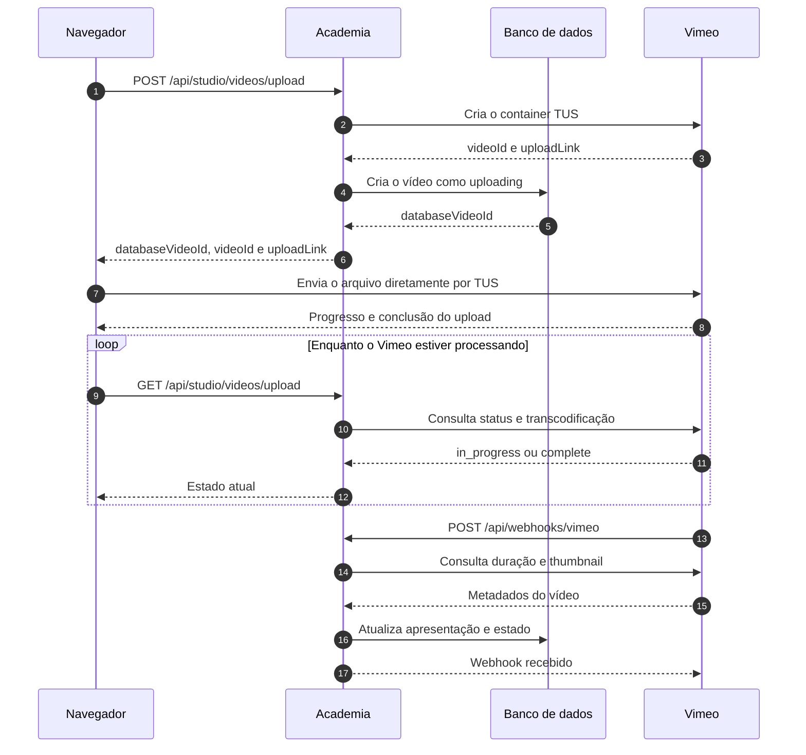

# Fluxo de upload de vídeos no Vimeo

Este documento é a referência do fluxo de upload de vídeos da Academia
Okajima. Ele descreve a responsabilidade do navegador, da aplicação, do banco
e do Vimeo desde a seleção do arquivo até o vídeo ficar pronto, ser cancelado
ou ser apagado.

## Visão geral

O arquivo não passa pelo servidor da Academia. O backend cria um container TUS
no Vimeo e um registro local em `videos`; depois o navegador envia o arquivo
diretamente ao `upload_link` retornado pelo Vimeo.



O banco da Academia é a fonte de verdade para o ciclo de vida exibido no
Studio. O Vimeo é a fonte de verdade para upload, transcodificação, duração e
miniaturas geradas automaticamente.

## Componentes principais

- `components/studio/uploads/video-upload-dialog.tsx`: seleção, TUS, progresso
  local, histórico visual, cancelamento e polling.
- `app/api/studio/videos/upload/route.ts`: cria, consulta e cancela o upload.
- `app/api/webhooks/vimeo/route.ts`: recebe e autentica eventos do Vimeo.
- `app/api/cron/vimeo-reconcile/route.ts`: recupera webhooks perdidos e corrige
  apresentações incompletas.
- `lib/vimeo/uploads.ts`: operações remotas de upload, status e exclusão.
- `lib/vimeo/webhooks.ts`: validação da assinatura e parsing dos eventos.
- `lib/studio/uploads/records.ts`: comandos e consultas de persistência.
- `lib/studio/uploads/sync.ts`: sincronização e reconciliação.
- `hooks/queries/use-studio-content.ts`: polling e mesclagem do progresso local
  na lista de Conteúdo.

## Estados persistidos

`videos.upload_status` aceita somente:

| Estado | Significado |
| --- | --- |
| `uploading` | O container e o registro existem; o navegador envia o arquivo. |
| `processing` | O TUS terminou e o Vimeo processa/transcodifica o vídeo. |
| `ready` | O Vimeo confirmou o fim do processamento/transcodificação. |
| `cancelled` | Um envio ainda não pronto foi cancelado ou falhou. |
| `deleted` | Um vídeo que já estava pronto foi removido do Vimeo. |

Transições normais:

```text
uploading -> processing -> ready
uploading -> cancelled
processing -> cancelled
ready -> deleted
```

`cancelled` e `deleted` são finais e permanecem no banco. O cancelamento nunca
apaga a linha de `videos`.

## Timestamps

- `upload_started_at`: criação do registro local.
- `upload_status_updated_at`: última transição persistida.
- `processing_started_at`: primeira entrada em `processing`.
- `ready_at`: instante em que o Vimeo confirmou o fim do processamento.
- `cancelled_at`: cancelamento antes de o vídeo ficar pronto.
- `deleted_at`: remoção de um vídeo que já estava pronto.

As atualizações incluem o estado anterior na cláusula `WHERE`. Eventos repetidos
são idempotentes e não reescrevem timestamps concluídos. O campo legado `time`
continua sendo a data do conteúdo; ele não armazena duração nem timestamps do
ciclo de upload.

## Fluxo detalhado

### 1. Seleção e preparação

O usuário seleciona ou arrasta um vídeo. O cliente deriva o título inicial do
nome do arquivo, detecta a qualidade, entra em `preparing` e chama
`POST /api/studio/videos/upload` com `title` e `size`.

`idle`, `preparing`, `cancelling`, `complete` e `error` são estados da interface,
não valores de `videos.upload_status`.

### 2. Criação remota e local

O endpoint autenticado:

1. chama `POST https://api.vimeo.com/me/videos` com `approach: "tus"`, tamanho,
   título e privacidade remota desabilitada;
2. recebe `videoId` e `uploadLink`;
3. cria a linha em `videos` com `upload_status = uploading`, `active = 0`,
   `converted = 0`, `approved = 0` e timestamps iniciais;
4. devolve `databaseVideoId`, `videoId` e `uploadLink` ao navegador.

Se o Vimeo criar o container, mas o INSERT falhar, o backend exclui o container
remoto como compensação. Falha nessa limpeza gera o log
`upload_compensation_failed`.

### 3. Envio TUS

O navegador usa `tus-js-client` para enviar o arquivo diretamente ao
`uploadLink`.

- `onProgress` calcula porcentagem e tempo restante pela velocidade média.
- Percentual e tempo restante existem somente na memória do navegador.
- Esses valores não são persistidos no banco.
- O envio atual não usa retomada por fingerprint nem retries automáticos TUS.
- Clicar fora não fecha o dialog. Ao fechar pelo X, por **Concluir** ou pela
  tecla `Esc`, os detalhes são persistidos antes do fechamento.
- Fechar o dialog não interrompe o upload; o provider continua montado no
  layout do Studio.

Na primeira página de `/studio/conteudo`, o `databaseVideoId` associa o progresso
local à linha da API. O TanStack Query consulta a lista a cada cinco segundos
enquanto houver `uploading` ou `processing` e para sem estados transitórios.

Recarregar a página perde a porcentagem e a estimativa, mas não o registro. A
linha continuará sendo atualizada por polling, webhook ou reconciliação.

### 4. Processamento

Quando o TUS termina, `onSuccess` muda a interface para `processing` e inicia o
polling de `GET /api/studio/videos/upload` a cada cinco segundos.

O endpoint consulta `status` e `transcode.status` no Vimeo:

- em andamento: confirma `uploading -> processing`;
- erro: informa falha ao cliente;
- completo: define `ready`/`ready_at`, `converted = 1` e `approved = 1`,
  depois tenta sincronizar duração e thumbnail.

O Vimeo também confirma mudanças por webhook. Polling e webhook são
intencionalmente redundantes e as transições são idempotentes.

### 5. Conclusão, duração e thumbnail

Quando o status do Vimeo ou um evento de transcode confirma o fim do
processamento, `completeVideoUpload` primeiro muda o registro para `ready`,
define `ready_at` e marca `converted = 1`. Assim, `ready_at` representa o fim do
processamento remoto e não depende da disponibilidade da thumbnail.

Como ainda não existe uma etapa de moderação editorial, a mesma transição marca
`approved = 1`. A exposição continua sendo controlada separadamente por
`privacy`: `0` é público, `1` é privado e `2` fica reservado para o futuro
estado não listado. O campo legado `active` não participa dessa decisão.

As consultas públicas exigem simultaneamente `upload_status = ready`,
`approved = 1`, `privacy = 0` e `deleted_at IS NULL`. O Studio continua podendo
listar estados não publicáveis para acompanhamento operacional.

Depois da transição, a aplicação consulta a apresentação e persiste `duration`
como `MM:SS` ou `HH:MM:SS` e a maior thumbnail válida. Se esses metadados ainda
não estiverem disponíveis, o vídeo permanece `ready`; eventos posteriores e a
reconciliação corrigem `00:00` ou `upload/photos/thumbnail.jpg` sem alterar
`ready_at`.

A thumbnail usada no fluxo de upload é sempre a automática do Vimeo. O modal
não aceita seleção, drag-and-drop nem envio de imagem personalizada. Eventos de
transcodificação, `automatic-thumbnail-available`, polling e reconciliação usam
a mesma rotina para selecionar a maior imagem retornada pelo Vimeo e persistir
sua URL no banco.

### Retomada após recarregar a página

O navegador não conserva o objeto `File` depois de um reload, mas o
`tus-js-client` persiste no armazenamento local a URL da sessão, o fingerprint
do arquivo e os IDs do vídeo no banco e no Vimeo. Enquanto o transporte TUS
estiver ativo, a porcentagem e o tempo restante continuam apenas em memória.

Quando o banco ainda indica `uploading` e não existe transporte ativo no
provider, a lista apresenta `Envio interrompido`. Para retomar, o usuário deve
selecionar novamente o mesmo arquivo. O cliente valida o tamanho persistido,
localiza a sessão pelo fingerprint e pelos dois IDs e chama
`resumeFromPreviousUpload`; o Vimeo responde ao `HEAD` com o offset confirmado e
o envio continua a partir desse ponto. Uma sessão ausente ou um arquivo
incompatível não cria outro vídeo automaticamente: o usuário pode cancelar o
registro atual e iniciar um novo envio.

### 6. Vídeo pronto no Studio

Depois de `ready`, as consultas periódicas da lista usam a thumbnail persistida
e não chamam o Vimeo para cada linha. O carregamento inicial do Server Component
ainda pode atualizar a apresentação pelo Vimeo. O painel do dialog exibe o
player do Vimeo com autoplay. `ready` significa que o Vimeo terminou o
processamento; os metadados visuais podem ser sincronizados logo depois.
Aprovação e publicação no catálogo são etapas separadas.

O endpoint de criação persiste o título inicial. Depois disso, título, descrição
e subcategorias permanecem editáveis no dialog. Qualquer fechamento explícito
envia o conjunto completo para `PATCH /api/studio/videos/upload`; o backend
valida a propriedade e as subcategorias ativas e atualiza os detalhes e vínculos
em uma única transação. O dialog só fecha depois de a persistência terminar com
sucesso.

## Cancelamento e exclusão

Ao confirmar **Cancelar envio**, o cliente:

1. chama `abort(false)` no TUS ativo;
2. chama `DELETE /api/studio/videos/upload` com os IDs local e remoto;
3. o backend valida sessão e propriedade;
4. exclui o vídeo no Vimeo; `404` remoto é sucesso idempotente;
5. persiste `cancelled`/`cancelled_at` antes de pronto ou
   `deleted`/`deleted_at` se já estava `ready`.

Se a exclusão remota falhar, o estado local não muda e a API responde `502`.
Assim o banco não declara como removido algo que ainda pode existir no Vimeo.

`video-upload-failed` tenta remover o container e marca o registro como
cancelado. `video-deleted` reflete no banco uma remoção feita no Vimeo.

## Webhooks

Todos os eventos apontam para:

```text
https://DOMINIO/api/webhooks/vimeo
```

Cadastre:

- `video-transcode-playable`
- `video-transcode-fully-playable`
- `video-transcode-complete`
- `video-upload-failed`
- `automatic-thumbnail-available`
- `video-updated`
- `video-deleted`

| Evento | Ação |
| --- | --- |
| `video-transcode-playable` | Confirma `processing`. |
| `video-transcode-fully-playable` | Define `ready_at` e sincroniza a apresentação. |
| `video-transcode-complete` | Define `ready_at` e sincroniza a apresentação. |
| `automatic-thumbnail-available` | Sincroniza a apresentação sem alterar `ready_at`. |
| `video-updated` | Sincroniza a apresentação sem alterar `ready_at`. |
| `video-upload-failed` | Remove o remoto e marca o local como removido. |
| `video-deleted` | Preserva a linha e marca `cancelled` ou `deleted`. |

`video-created` é reconhecido pelo parser, mas hoje não provoca transição.

### Autenticação

Use a mesma **Secret key** nos webhooks e em `VIMEO_WEBHOOK_SECRET`. O endpoint
lê o corpo bruto e valida HMAC-SHA256 de `X-Webhook-Signature` ou
`X-Vimeo-Signature`. Aceita hex ou base64 com prefixo `sha256=` ou `v1=` e usa
comparação em tempo constante.

- assinatura ausente ou inválida: `401`;
- JSON ou evento inválido: `400`;
- payload acima de 64 KiB: `413`;
- falha de processamento: `500`, permitindo retry do Vimeo.

Não existe fallback por query string ou Bearer token.

## Reconciliação

Webhooks podem atrasar ou se perder. `/api/cron/vimeo-reconcile` consulta até 25
registros por execução:

- todos em `processing`;
- `ready` com duração `00:00`;
- `ready` ainda usando o placeholder de thumbnail.

Os mais antigos por `upload_status_updated_at` são processados primeiro. O cron
consulta o Vimeo e aplica a mesma rotina dos webhooks, inclusive reparando dados
criados por versões antigas.

A rota exige `Authorization: Bearer CRON_SECRET`. Em `vercel.json` está
agendada diariamente às `03:17 UTC`:

```json
{
  "path": "/api/cron/vimeo-reconcile",
  "schedule": "17 3 * * *"
}
```

## Variáveis privadas

- `VIMEO_ACCESS_TOKEN`: token com upload, leitura, edição e exclusão.
- `VIMEO_WEBHOOK_SECRET`: secret configurada nos webhooks.
- `CRON_SECRET`: segredo da rota de reconciliação.

Nenhuma pode usar `NEXT_PUBLIC_` ou chegar ao bundle do navegador.

## Produção e desenvolvimento local

- O Vimeo precisa de URL HTTPS pública. `localhost` não recebe webhooks; em
  desenvolvimento use um túnel como ngrok.
- Todos os tipos de webhook podem usar a mesma URL.
- Deployments protegidos pela autenticação da Vercel bloqueiam o Vimeo.
- O banco deve estar acessível pela função da Vercel.
- Ao trocar a URL do túnel, atualize todos os webhooks.
- A secret no Vimeo e no ambiente receptor deve ser idêntica; divergência gera
  `401 Unauthorized`.

## Invariantes

1. O registro local existe antes do início do TUS.
2. Todo upload guarda os IDs local e remoto.
3. `ready_at` registra o fim do processamento no Vimeo, independentemente da thumbnail.
4. O modal de upload usa exclusivamente a thumbnail automática do Vimeo.
5. Cancelamento e exclusão preservam histórico no banco.
6. Percentual e tempo restante são efêmeros.
7. Webhooks, polling e cron podem repetir operações sem reescrever timestamps.
8. Falha de exclusão remota não produz sucesso local.
9. O campo legado `time` não participa da duração.

## Diagnóstico rápido

### `403 upload_container_creation_failed`

Verifique `VIMEO_ACCESS_TOKEN`, os escopos, a permissão de upload da conta e se
o token pertence à conta correta.

### `401` no webhook

Compare a Secret key do Vimeo com `VIMEO_WEBHOOK_SECRET` no ambiente receptor.
Confirme que proxy ou túnel não altera o corpo bruto nem remove os headers.

### Vídeo com `00:00` ou sem thumbnail

Confira:

1. `upload_status`, `duration`, `thumbnail` e `vimeo` em `videos`;
2. `status` e `transcode.status` na API do Vimeo;
3. entrega dos eventos de transcode e thumbnail;
4. logs `webhook_processing_failed` e `reconciliation_incomplete`;
5. execução autorizada de `/api/cron/vimeo-reconcile`.

Não corrija `ready_at` manualmente. Execute a reconciliação para consultar o
Vimeo e persistir os metadados ausentes sem reescrever o timestamp.

## Testes essenciais

- criação remota seguida da criação local;
- compensação quando o INSERT local falha;
- progresso TUS sem persistir percentual;
- transição `uploading -> processing -> ready`;
- definição idempotente de `ready_at` assim que o Vimeo concluir o processamento;
- reparo de duração ou thumbnail ausente sem reescrever `ready_at`;
- persistência da maior thumbnail automática retornada pelo Vimeo;

- cancelamento idempotente e permanência do registro;
- distinção entre `cancelled` e `deleted`;
- assinatura válida e inválida de webhook;
- eventos repetidos sem reescrever timestamps;
- reconciliação de `processing` e `ready` incompleto;
- polling da lista somente durante estados transitórios.
